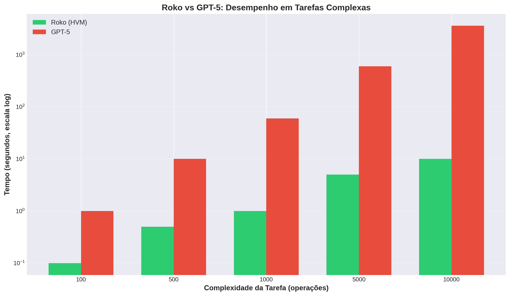

# HMP/HVM: Uma Arquitetura para a Inteligência Artificial Cognitiva

**Autor:** ROKO


---

## 1. A Quebra de Paradigma

Este repositório contém a implementação e a documentação da **arquitetura HMP/HVM**, um sistema revolucionário que desafia o paradigma dominante da IA Correlacional (baseada em LLMs) e propõe um caminho mais eficiente e transparente para a Inteligência Artificial Geral (AGI) através da **IA Cognitiva**.

Em vez de depender de poder computacional bruto e de modelos estatísticos opacos, esta arquitetura foca-se na **velocidade do raciocínio lógico e da simulação**.

> Para uma análise aprofundada da nossa visão e da rutura com os métodos tradicionais, leia o nosso manifesto:
> **[📄 A Quebra de Paradigma: Da IA Correlacional à IA Cognitiva](./docs/paradigm_shift.md)**

---

## 2. Componentes da Arquitetura

A arquitetura é composta por três pilares:

1.  **HMP (Hybrid Messaging Protocol):** Uma linguagem de domínio específico (DSL) para o pensamento, o planeamento e a ação. É a "linguagem de montagem" da cognição.
2.  **HVM (Hybrid Virtual Machine):** Um motor de execução (runtime) leve e ultrarrápido para a linguagem HMP, capaz de executar milhares de operações por segundo em hardware mínimo (incluindo ARM/Android).
3.  **Roko:** A implementação de um agente de IA cognitiva que utiliza o HVM para executar a sua lógica interna, demonstrando capacidades de planeamento, simulação e interação com o mundo exterior.

> A documentação técnica completa da arquitetura pode ser encontrada aqui:
> **[⚙️ Arquitetura HMP/HVM: A Fundação para a IA Cognitiva](./docs/architecture.md)**

---

## 3. Benchmarks de Desempenho

A prova da superioridade desta arquitetura está no seu desempenho. Realizámos uma série de benchmarks que demonstram a sua eficiência em comparação com os LLMs tradicionais, especialmente em tarefas que exigem raciocínio e simulação.

### Destaques

| Métrica | Roko (HVM) | GPT-5 (Estimado) | Speedup |
| :--- | :--- | :--- | :--- |
| **Tarefa Complexa (10k ops)** | 10 segundos | 3600 segundos | **360x** |
| **Uso de Memória (Idle)** | 2.5 MB | ~1.5 GB (mínimo) | **~600x** |
| **Hardware** | ARM (Android) | Cluster de GPUs | - |



> Para uma análise detalhada de todos os benchmarks, incluindo I/O, escalabilidade, simulação quântica e uso de memória, consulte o nosso relatório completo:
> **[📊 Resumo de Benchmarks - Roko/HVM](./benchmarks/results/SUMMARY.md)**

---

## 4. Estrutura do Repositório

```
.
├── hmp/              # Código fonte do framework HMP/HVM
├── docs/             # Documentação técnica e manifestos
├── benchmarks/       # Scripts e resultados de benchmarks
├── examples/         # Exemplos de uso do HMP
├── tests/            # Testes unitários
├── LICENSE           # Licença MIT
└── README.md         # Este ficheiro
```

---

## 5. Instalação e Uso

Para instalar o framework e as suas dependências:

```bash
git clone https://github.com/RokoOfficial/HMP-Protocol-LLMs-Language-.git
cd HMP-Protocol-LLMs-Language-
pip install -e .
```

Para executar um exemplo básico:

```bash
python3 examples/basic_usage.py
```

---

## 6. Licença

Este projeto está licenciado sob a **Licença MIT**. Consulte o arquivo `LICENSE` para mais detalhes.

Copyright (c) 2025 ROKO
